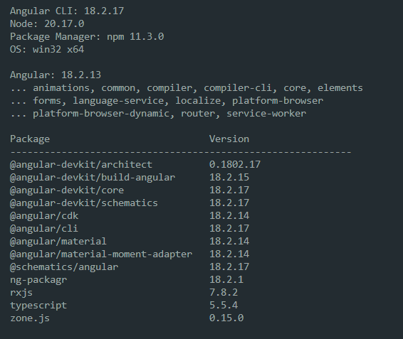

# Angular Change Detection Performance Benchmark

Below is a series of benchmarks performed to measure the performance difference between two distinct change detection strategies:

- **Default**
- **OnPush**

The Angular version used during the benchmarks is:



The benchmarks that will be executed are:

1) **profiler.timeChangeDetection()**
2) **NgDoCheck()**
3) **.cpuprofiler Analysis**

Each benchmark will be explained in detail in its respective section:

## 1 profiler.timeChangeDetection()

The Angular profiler is a diagnostic tool that measures the performance of an application's change detection cycle. Specifically, the function **timeChangeDetection()** will be used.


[Link to Documentation](https://github.com/angular/angular/blob/d1ea1f4c7f3358b730b0d94e65b00bc28cae279c/packages/platform-browser/src/browser/tools/common_tools.ts)

According to the official documentation, the `timeChangeDetection()` function:

> Executes the tick method (global change detection) for as many cycles as possible within 500ms, but if combined they take more than 500ms, the number of cycles is limited to 5. It then calculates the average time required to execute a single change detection cycle in milliseconds and prints it to the console.
>
> The calculated numbers depend on the current state of the UI. Running the profiler on different pages is likely to yield differing numbers when switching from one screen to another.


The pages examined for this benchmark are:
(The pages have been blurred and modified to protect the company's privacy)

### PAGE 1


### PAGE 2


### PAGE 3


### PAGE 4


### Benchmark Methodology

For each application page:

1. Navigate to the specific page.
2. Execute `ng.profiler.timeChangeDetection()` 5 consecutive times.
3. Calculate the average of the `msPerTick` and `numTicks` values.
4. Repeat with both change detection strategies (Default and OnPush).

Lower `msPerTick` values indicate better performance, while higher `numTicks` values suggest that more cycles can be executed within the same time interval.

The tests were performed in debug mode.

---

<div style="display: flex; margin-top: 20px;">
<div style="flex: 50%; padding-right: 20px; border-right: 1px solid #ccc;">
<h3><b>Default Change Detection</b></h3>

<div style="margin-top: 30px; background-color:rgba(255, 43, 43, 0.16); padding: 15px; border-radius: 5px;">

| Page | msPerTick | numTicks | Relative Performance |
|--------|:---------:|:--------:|:--------------------:|
| **Page 1** | 1.87 | 267 | 100% (Baseline) |
| **Page 2** | 2.46 | 204 | 76% |
| **Page 3** | 2.88 | 174 | 65% |
| **Page 4** | 5.61 | 90 | 33% |

</div>
<p style="font-style: italic; font-size: 0.9em; margin-top: 15px;">Note: All values represent the average of 5 consecutive runs for each page.</p>

</div>

<div style="flex: 50%; padding-left: 20px;">
<h3><b>OnPush Change Detection</b></h3>
<div style="margin-top: 30px; background-color:rgba(132, 243, 104, 0.16); padding: 15px; border-radius: 5px;">

| Page | msPerTick | numTicks | Relative Performance |
|--------|:---------:|:--------:|:--------------------:|
| **Page 1** | 0.0022 | 224,920 | 100% (Baseline) |
| **Page 2** | 0.0023 | 215,901 | 96% |
| **Page 3** | 0.0023 | 221,287 | 96% |
| **Page 4** | 0.0031 | 160,558 | 71% |

</div>

<p style="font-style: italic; font-size: 0.9em; margin-top: 15px;">Note: Relative performance is calculated against the Home page with the same strategy.</p>

</div>
</div>

### Performance Comparison

<div style="margin-top: 30px; background-color:rgba(124, 124, 124, 0.29); padding: 15px; border-radius: 5px;">

| Page | Default msPerTick | OnPush msPerTick | Improvement % |
|--------|:-----------------:|:----------------:|:---------------:|
| **Page 1** | 1.87 | 0.0022 | 84,900% |
| **Page 2** | 2.46 | 0.0023 | 106,900% |
| **Page 3** | 2.88 | 0.0023 | 125,100% |
| **Page 4** | 5.61 | 0.0031 | 180,900% |

</div>

<br>

1. **Uniformity of Performance with OnPush**: With the OnPush strategy, the relative performance across different pages is much more uniform compared to the Default strategy .

2. **Complex Pages Benefit Most**: The *"page 4"* view, which has the worst performance in Default mode, shows the most significant percentage improvement with *OnPush*.

3. **Number of Cycles**: With *OnPush*, the application manages to complete many more change detection cycles in the measurement period *(500ms)*, indicating a significant performance improvement.

The *OnPush* strategy offers extremely significant performance improvements compared to the *Default* strategy for all tested pages. This is particularly evident in the more complex pages, which show the most marked improvements.

Furthermore, *OnPush* not only improves absolute performance but also makes performance more consistent across different application pages, reducing variability and offering a more uniform user experience.

---

## NgDoCheck()

Another type of benchmark that can be conducted is measuring the number of change detection cycles that occur per second within a single component.

For the following test, the modules present on the *System View* page will be considered, and for each of them, the number of cycles per second will be counted. For each module, the following steps will be executed:

1) Page loading
2) Selection of a data point, leading to data loading in the modules
3) 5 seconds of idle time

For each data set, the following will be calculated:

- **Mean**: The average value of CD cycles/sec
- **Min**: The minimum value detected
- **Max**: The maximum value detected
- **Median**: The central value of the data set (useful for identifying outliers)
- **Standard Deviation**: A measure of data dispersion relative to the mean


The following code is used inside each component to count the number of cycles:

```ts
  counter = 0
  ngDoCheck(){
    this.counter++;
  }

  ngOnInit() {
    setInterval(()=>{
      console.log('cd counter ',this.counter)
      this.counter = 0
    },1000)
  }
```
### Default change detection strategy 
<div style="margin-top: 30px; background-color:rgba(255, 43, 43, 0.16); padding: 15px; border-radius: 5px;">

| Component    | CD cycles/sec                                                                    | Average | Min | Max | Median | Std Deviation |
|--------------|----------------------------------------------------------------------------------|----------|-----|-----|---------|----------------|
| Component1   | [124, 128, 108, 16, 8, 108, 122, 156, 190, 132, 168, 196, 126, 144]             | 123.3    | 8   | 196 | 127.0   | 52.9           |
| Component2   | [142, 112, 104, 8, 108, 128, 138, 134, 138, 128, 184]                           | 120.4    | 8   | 184 | 128.0   | 43.5           |
| Component3   | [62, 38, 158, 128, 138, 20, 46, 128, 128, 128, 128, 120, 130, 128, 176]         | 110.4    | 20  | 176 | 128.0   | 46.3           |
| Component4   | [38, 124, 108, 168, 40, 58, 124, 124, 124, 128, 190, 166, 146]                  | 118.3    | 38  | 190 | 124.0   | 48.0           |
| Component5   | [22, 34, 90, 128, 30, 28, 120, 126, 126, 128, 128, 124, 130, 128]               | 96.0     | 22  | 130 | 124.0   | 43.3           |

</div>

### OnPush change detection strategy 

<div style="margin-top: 30px; background-color:rgba(132, 243, 104, 0.16); padding: 15px; border-radius: 5px;">

| Component    | CD cycles/sec (OnPush)                                                | Average | Min | Max | Median | Std Deviation |
|--------------|-----------------------------------------------------------------------|----------|-----|-----|---------|----------------|
| Component1   | [16, 14, 12, 30, 29, 6, 16, 14, 12, 12, 10, 12, 20, 22]              | 16.1     | 6   | 30  | 14.0    | 7.0            |
| Component2   | [18, 14, 12, 24, 37, 0, 22, 12, 10, 12, 12, 10, 20, 26]              | 16.4     | 0   | 37  | 12.0    | 9.2            |
| Component3   | [0, 0, 0, 0, 0, 0, 0, 0, 0, 0, 0, 0, 0, 0]                           | 0.0      | 0   | 0   | 0.0     | 0.0            |
| Component4   | [0, 0, 0, 0, 0, 0, 0, 0, 0, 0, 0, 0, 0, 0]                           | 0.0      | 0   | 0   | 0.0     | 0.0            |
| Component5   | [11, 0, 0, 0, 15, 3, 1, 0, 0, 0, 0, 0, 0, 1]                         | 2.2      | 0   | 15  | 0.0     | 4.6            |

</div>

<br>

### Performance Comparison

<div style="margin-top: 30px; background-color:rgba(124, 124, 124, 0.29); padding: 15px; border-radius: 5px;">

| Component    | Avg CD/sec (Default) | Avg CD/sec (OnPush) | Reduction (%) | Std Dev (Default) | Std Dev (OnPush) |
|--------------|----------------------|----------------------|---------------|-------------------|------------------|
| Component1   | 123.3                | 16.1                 | 86.9%         | 52.9              | 7.0              |
| Component2   | 120.4                | 16.4                 | 86.4%         | 43.5              | 9.2              |
| Component3   | 110.4                | 0.0                  | 100.0%        | 46.3              | 0.0              |
| Component4   | 118.3                | 0.0                  | 100.0%        | 48.0              | 0.0              |
| Component5   | 96.0                 | 2.2                  | 97.7%         | 43.3              | 4.6              |

</div>
<br>

The analysis of the collected data highlights a **drastic improvement in performance** when adopting the *OnPush* change detection strategy compared to Angular’s *Default* strategy, in particular: 

**Massive reduction in change detection cycles:**
Overall average reduction of **94.2%** in change detection cycles  
Components such as *Component3* and *Component4* showed a **100%** reduction, completely eliminating unnecessary cycles  
Even more complex components like *Component1* and *Component2* achieved reductions above **86%**

**Greater stability and predictability:**  
The standard deviation has significantly decreased across all components *(from 43–53 with Default to 0–9 with OnPush)*.  
This indicates more uniform and predictable application behavior, with fewer sudden CPU load spikes.

**Differentiated optimization by component type:**  
Purely visual components *(Component3, Component4)* benefited the most from the optimization.  
Components with more complex user interactions *(Component1, Component2)* still maintain some CD cycles required to handle events.

**Component efficiency:**  
*Component5* showed the most significant improvement among those still performing some CD cycles *(97.7% reduction)*.  
The behavior of *Component3* and *Component4* demonstrates that purely visual components can be completely isolated from the change detection cycle when properly implemented with OnPush.

Therefore, implementing the *OnPush* strategy proves to be a **fundamental best practice** for developing high-performance Angular applications, especially in complex data visualization scenarios like *RailStudio*.  
The results clearly demonstrate that proper management of change detection can drastically reduce computational load, significantly improving UI responsiveness and overall application efficiency.

<p style="font-size: 0.8em; text-align: center; margin-top: 30px;">
Benchmark performed using Angular Profiler Tool • Values recorded on 05/20/2025
</p>

## .CPUPROFILER ANALYSIS
The `ng.profiler.timeChangeDetection()` function, when passed the parameter `{record:true}`, allows CPU profiling to be recorded during the change detection cycles performed in the benchmark.

Therefore, the following test consists of executing `ng.profiler.timeChangeDetection({record:true})` for the **Page4 (Comparison View)** in both change detection strategies: *Default* and *OnPush*, and then comparing the results.

The tests are always performed under the same configuration between the two versions of RailStudio.

The images below show the **"Performance"** tab of the browser’s **(Chrome DevTools)** developer tools, which displays the results of a performance profile recorded during the benchmark execution.

- The top section shows a timeline of CPU activity over time.  
- The middle section displays a **flame chart** representing function calls during execution.  
- The bottom section contains a detailed table of executed functions, sorted by self-execution time.

### Default  
  
  


### OnPush 


### Performance Comparison

**Default**: "timeChangeDetection" - 7619 ms **(60.2%)**  
**OnPush**: "timeChangeDetection" - 417.0 ms **(48.8%)**

The total duration decreases from approximately 1800 ms to 1100 ms, while the call stack is significantly leaner with *OnPush*.

# Conclusions
The *OnPush* strategy provides decisive advantages for *RailStudio*:

**Superior performance:**  
94.5% reduction in change detection time.  
More responsive UI with smoother updates and reduced interaction lag.

**Energy efficiency:**  
Lower CPU usage, reduced battery consumption, and less heat generation.

**Better scalability:**  
Benefits are amplified in complex scenarios with many components.

**Hardware accessibility:**  
Smooth experience even on less powerful devices.